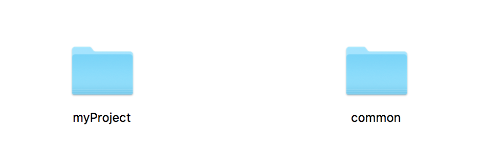
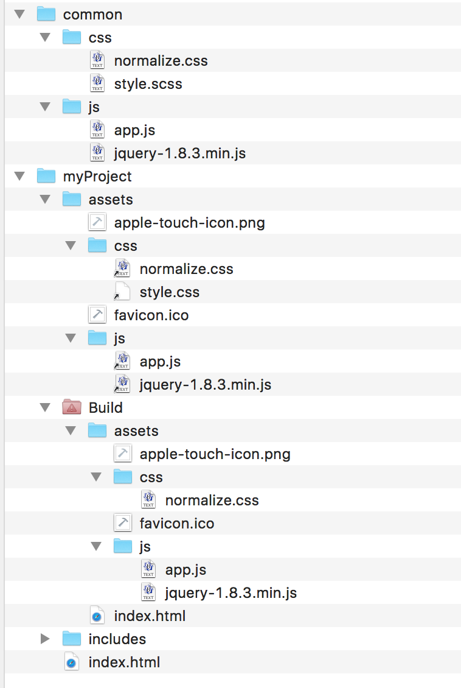

# Using Symlinks in Hammer

With the help of some simple symlinks you can enhance your productivity quite a bit by creating common assets used across your projects.

## What is it good for?
Lots of times I use quite some assets, libraries, utilites, etc... commonly in various projects. This requires me to either copy a generic project and remove what's not needed, or create a new project and drag in my required files. This is cumbersome and boring.

When I change one (or more) of these commonly used files, I must go through all my projects and change/replace the changed files there as well. This is even more boring and error-prone.

With the help of some symlinks we can easify this process, by putting commonly used files into a shared folder and use these files (from within Hammer) for all of our projects.

## How does it work?
Let me show you the power of this technique by a simple example:

*(I am explaining some exact steps for the not-so-experienced folks, so please everybody bear with me)*

*	First we create an empty project right from within Hammer (of course, you can it manually as well)
* For better readability I renamed the project to 'myProject'
* Create another folder 'common' in the same folder as the your Hammer project.

Now your folder should look something like this:
[](https://github.com/tiptronic/hammerlinks/blob/master/assets/1_structure.png)

* Create a folder 'js' in folder 'common'
* Now move the jQuery-Library  ('jquery-1.8.3.min.js' at the time of this writing) from folder 'myProject/js' into folder 'common/js'
* Remove the jQuery-Library from folder 'js' in 'myProject'

Fire up your terminal and type in 

```
$ ln -s 
```
followed by a space character.

--
*With 'ln' you create a link in UNIX/LINUX. The '-s' option lets us create a `symlink`, which is a hard link to the original file (which means your computer treats it as if it were the original file).*

--

Now drag the jQuery Library from the 'js' folder from 'myProject' to the terminal window. It should look like this:

```
$ ln -s /Users/andy/hammertest/common/js/jquery-1.8.3.min.js
```
Drag the 'js' folder from 'myProject' into the terminal window (it get's appended). The command should now look like this:

```
$ ln -s /Users/andy/hammertest/common/js/jquery-1.8.3.min.js /Users/andy/hammertest/myProject/assets/js

```

--
*Using this command, you tell your computer to create a link to the jQuery-Library (located in 'common/js') in you project's 'js' folder.*

--

To check out if it works, just hit the ENTER-key on your keyboard (while in terminal, of course).

You should now see a file-icon with a small arrow appear in your project's 'js' folder.

Repeat these steps for any other file (no matter if it's js, css or images)

Your final result could then look something like this:
[](https://github.com/tiptronic/hammerlinks/blob/master/assets/2_structure_with_links.png)

As you can see in the screenshot, all symlinks where followed properly and the files from the 'common'-folder were copied to the appropriate Build folder.

Try out creating a second project and add the common-files there as well, then change something e.g. in app.js and see it magically appear in both of your projects.

Enjoy!

## What if you want to sync your project across computers?

Glad you asked!

As you might have realized, the symlinks in our example use absolute paths. So when you move your files (or sync it to a different path on another machine), everything breaks...

**Not good!**

Fortunately our terminal has a solution for this!

## Relative Symlinks
Although the steps are quite similar as above, we need a tiny change in our terminal command(s):

First we must navigate to our project folder (using the infamous *cd* (change directory) command in the terminal:

```
$ cd /Users/andy/hammertest/myProject/assets/js
```
Now the terminal's working directory is our project's 'js' directory/folder. What's needed is to create a `relative symlink` to our common jQuery-Library.

Fortunately this works exactly as if we were creating a relative file-path in our HTML, which results in this command:

```
ln -s ../../../common/js/jquery-1.8.3.min.js 
```
Hit ENTER and watch the link appear in the project's 'js' folder.

Now you can move the project and the common folder to any other location (or computer) and Hammer will build just fine.

Using this technique you can build your own (relative) folder-structure and keep files organized as you like. When you need to change a file, just replace the source-file - your symlinks will stay intact and still point to the correct (new) file. 

Therefore I always remove version numbers from the source files. In this case I'd rename 'jquery-1.8.3.min.js' to 'jquery.min.js', so if I update the jQuery-library, all of my projects just need to get rebuild and then carry the new library (Don's forget to test your builds afterwards!)


## One more thing
Here's a quick tip, if you want to share a whole bunch of files from a common folder to your project(s). You don't need to move every file after the other. Depending how your assets are organized, you can move all assets at once.

Again, in the terminal cd to the target folder:

```
$ cd /Users/andy/hammertest/myProject/assets/js
```
And create symlinks for all files in your 'js' folder at once:

```
$ ln -s ../../../common/js/* 
```
...that was fast....


####Please note: Hammer doesn't like symlinked folders, so you can't (for now - *hint, hint*) use Hammer's file references with folders


